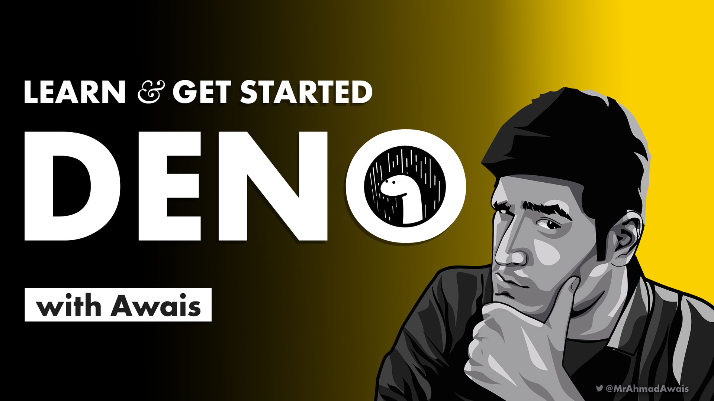

[][d]

# Learn Deno

> Learn Deno with my free video course at [Deno Beginner][d].

A secure runtime for JavaScript and TypeScript.

> Deno is a simple, modern and secure runtime for JavaScript and TypeScript that uses V8 and is built in Rust.

- Secure by default. No file, network, or environment access, unless explicitly enabled.
- Supports TypeScript out of the box.
- Ships only a single executable file.
- Has built-in utilities like a dependency inspector (deno info) and a code formatter (deno fmt).
- Has a set of reviewed (audited) standard modules that are guaranteed to work with Deno: deno.land/std

## Deno For Beginners Course

[Learn deno][d] by example. In this free crash course, [Awais](https://twitter.com/MrAhmadAwais/) will teach you what is Deno, how is Deno different than Node.js, and together you'll build three simple projects with deno. Not sure why I wrote that in 3rd person. 😆

[][d]

_Caution: Shameless plug ahead! Support my work._ ↓

> - [🚀&nbsp;&nbsp; VSCode.pro Power User Coursre][v] →
> - [📟&nbsp;&nbsp; Build Node.js CLIs Automation][n] →

## Course Contents

- ✅&nbsp;&nbsp; ACCESS: All Modules
- ✅&nbsp;&nbsp; VIDEOS: Every Course Video
- ✅&nbsp;&nbsp; EXAMPLES: Over 3 Example Projects
- 📺&nbsp;&nbsp; MODULE #1: Introduction to Deno
- 📺&nbsp;&nbsp; MODULE #2: Deno vs Node
- 📺&nbsp;&nbsp; MODULE #3: Deno: A fun tip
- 📺&nbsp;&nbsp; MODULE #4: Deno Core
- 📺&nbsp;&nbsp; MODULE #5: Installing Deno
- 📺&nbsp;&nbsp; MODULE #6: Deno CLI Review
- 📺&nbsp;&nbsp; MODULE #7: Deno with VSCode
- 📺&nbsp;&nbsp; MODULE #8: Deno CLI Help: Run
- 📺&nbsp;&nbsp; MODULE #9: Project #1: Hello Deno
- 📺&nbsp;&nbsp; MODULE #10: Project #2: Deno `cat`
- 📺&nbsp;&nbsp; MODULE #11: Project #3: Deno Server
- 📺&nbsp;&nbsp; MODULE #12: Deno.Land: Tools & Docs
- 📺&nbsp;&nbsp; MODULE #13: Deploy a Deno Website
- 📺&nbsp;&nbsp; MODULE #14: What's Next with Deno

### [Free: Sign up & Watch Now](https://DenoBeginner.com/?utm_source=dev.to&utm_medium=referral&utm_campaign=Launch%20Post) →

[][d]

[][d]

 

## Sponsor

Me ([Ahmad Awais](https://twitter.com/mrahmadawais/)) and my incredible wife ([Maedah Batool](https://twitter.com/MaedahBatool/)) are two engineers who fell in love with open source and then with each other. You can read more [about me here](https://ahmadawais.com/about). If you or your company use any of my projects or like what I’m doing then consider backing me. I'm in this for the long run. An open-source developer advocate.

[v]: https://VSCode.pro/?utm_source=dev.to&utm_medium=referral&utm_campaign=Launch%20Post
[n]: https://NodeCLI.com/?utm_source=dev.to&utm_medium=referral&utm_campaign=Launch%20Post
[d]: https://denobeginner.com/?utm_source=github.com&utm_medium=referral&utm_campaign=Learn%20Deno
